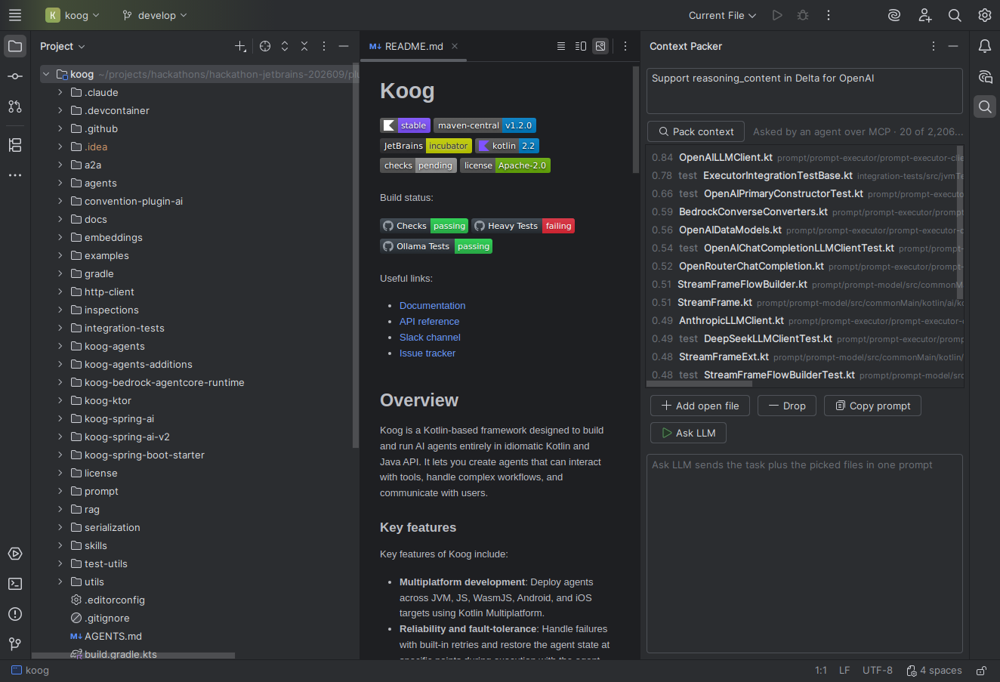

# Context Packer

An IntelliJ plugin that finds the files a coding task needs in about three seconds, so an agent
can skip the part where it reads the repository one file at a time.

Type a task, or let an agent call the `pack_context` MCP tool, and it scores every source file in
the project against that task. You get back the ten or twenty files most likely to matter, with
tests flagged.

## Does it work?

It's measured on real history. Each task is a real commit subject from
[JetBrains/koog](https://github.com/JetBrains/koog) and the right answer is the `.kt` files that
commit changed. Every file is read as it was *before* the commit, so the answer can't leak in.
Settings were chosen on 40 dev tasks, then measured once on 70 test tasks nobody had looked at.

| 70 held-out tasks | recall@5 | recall@10 | recall@20 |
| --- | --- | --- | --- |
| BM25 keyword search | 0.42 | 0.53 | 0.63 |
| **Context Packer** | **0.54** | **0.69** | **0.80** |

That's +16 points of recall@10, with a 95% bootstrap interval of +10 to +23. In the IDE on Koog
(2,206 files) a pack takes about 4.5 s warm and 6.6 s in a freshly started IDE, for 53-56 Jev calls
and about $0.03. Details, including the version that *didn't* beat BM25 and why, are in
[spike/RESULTS.md](spike/RESULTS.md).

## How it works

Jev is TypeSafe's decision model. It can't write text; it answers typed questions with calibrated
probabilities, fast and cheaply. That makes it the right tool for asking one question about
thousands of files, and the wrong one for writing the fix. So the fix is left to an LLM, and the
plugin does the looking.

1. **Collect.** Every source file in the project, minus excluded, generated, library, binary and
   files over 100 KB.
2. **Sketch.** Each file becomes a ~300-token summary: path, package, and declarations two levels
   deep with the first line of each doc comment. It's the same sketcher the eval measured (a
   parity test checks the Kotlin port against it), it takes about 1.4 s for 2,206 files, and it's
   cached by modification stamp. Sketches built from the IDE's Structure View read better but
   cost ~19 ms a file cold and are unmeasured; `CONTEXT_PACKER_PSI_SKETCH=1` turns them on.
3. **Pass 1.** Jev reads 60 sketches per call and answers, for each one, "Implementing the change
   described in `task` requires reading or editing the file in `f07`." BM25 ranks the full text
   at the same time.
4. **Pool.** The top 60 from each.
5. **Pass 2.** Jev asks the same question again over the *full source* of just the pool, 6 files
   per call. Sketches hide what many tasks are about, and a small pool makes full source affordable.
6. **Fuse.** Jev's score and BM25 rank count equally. That weighting was chosen on dev tasks.

Jev alone on sketches loses to plain keyword search (0.39 against 0.46 recall@10 in the spike).
It's the re-rank on full source, fused with BM25, that wins.

### Fast keywords (local)

Select **Fast keywords (local)** in the tool window or call `pack_context` with `provider=keywords`.
For a fresh project, `CONTEXT_PACKER_PROVIDER=keywords` sets the initial choice; a saved UI preference
takes precedence over that environment default. This explicit mode ranks the **full eligible source
corpus** with BM25 over paths and file text. It needs no API key or model server, makes no model
request, and has $0 API fee and zero API tokens; local CPU and electricity are not priced. The UI
and MCP output show ordinal keyword ranks, not model relevance or correctness confidence. It does
not generate or cache sketches, so switching back to Jev or Laya still builds their normal inputs.
There is no automatic fallback between providers.

BM25 is the predeclared keyword baseline in the table above. Those measurements compare it with
the Jev pipeline on that task set; they do not establish which mode will be best for every project
or task. **Copy prompt** and **Ask OpenRouter (cloud)** remain separate actions; the latter still
sends selected file contents to OpenRouter when clicked.

## Install

Needs an IntelliJ-based IDE, 2025.2 or newer.

1. Get `build/distributions/context-packer-0.1.0.zip`, or build it with `./gradlew buildPlugin`.
2. **Settings | Plugins | ⚙ | Install Plugin from Disk…** and pick the zip.
3. **Tools | Context Packer: Set API Keys…**:
   - `TYPESAFE_API_KEY` for Jev, through TypeSafe's own API. This is the fast path.
   - `AI_GATEWAY_API_KEY` is the fallback when there's no TypeSafe key, or when
     `JEV_BACKEND=gateway` is set. Vercel serves the same model, but in testing it answered only
     about 30% of calls under load (429s and 503s), so a pack takes 30-60 s.
   - `OPENROUTER_API_KEY`, only for the **Ask LLM** button. Jev never goes through OpenRouter.

   Environment variables with the same names work too, and win over stored keys. Before starting
   another pack, the plugin checks whether the session has reached 20M **reported** Jev input tokens;
   set `CONTEXT_PACKER_TOKEN_BUDGET` to change that threshold. An in-progress pack can exceed it,
   and missing usage cannot be counted, so this is not a strict spending cap. Requests include
   retry attempts; any unknown usage makes the pack's API fee unavailable rather than zero.

   Fast keywords needs none of these keys. Laya uses a local server instead of an API key.

## Use it

**In the IDE.** Open the **Context Packer** tool window (magnifier icon, right stripe), describe
the change and press **Pack context** or Ctrl+Enter. Double-click a pick to open it, press Delete
to drop one, and use **Add open file** to pin one it missed. Then **Copy prompt** puts the task
plus every picked file on the clipboard, or **Ask OpenRouter (cloud)** sends it to `z-ai/glm-5.3-flash` through
OpenRouter. Set `CONTEXT_PACKER_LLM_MODEL` to use a different model.



*An agent called `pack_context` over MCP; the tool window shows what it was handed, 4.4 s later.*

**From an agent.** The plugin adds a `pack_context` tool to the IDE's built-in MCP server. Turn the
server on in **Settings | Tools | MCP Server**, then point your agent at it. For Claude Code:

```
claude mcp add --transport sse jetbrains http://127.0.0.1:64342/sse
```

The tool's description tells the agent to call it before searching. Whatever an agent asks for
also appears in the tool window, marked as asked by an agent, so you can see the context it was
given. If the IDE runs on Windows and the agent in WSL, localhost only reaches the IDE with WSL's
mirrored networking turned on.

## Demo script

About two minutes, on a Koog checkout:

1. Open the tool window. Type *"Support reasoning_content in Delta for OpenAI"* and pack. The
   status line shows files scored, seconds, Jev calls and cost. `OpenAILLMClient.kt` comes first.
2. Hover the status line for the stage timings, and a pick for its Jev score and keyword rank.
3. Press **Ask OpenRouter (cloud)**. The model answers from the picked files in one shot, with no exploring.
4. In a terminal, ask Claude Code to make the same change. It calls `pack_context` first and goes
   straight to the right files.
5. Close with the table above. It's measured on commits from JetBrains' own agent framework.

## Against an LLM, and inside an agent

Full numbers are in the [eval report](https://taanviir.github.io/hackathon-jetbrains-202609/feat-context-packer/context-packer-eval/).

**Against an LLM re-ranker.** GLM-5.3 Flash re-ranked BM25's top 30 on full source, on the same 70 tasks. It picks
the top five better (recall@5 0.61 against 0.52 for Jev + BM25, a significant gap), and at ten they tie (0.67 against
0.65). Jev does it in about 1 s for about $0.002, where the LLM takes 29 s and $0.007. Jev's edge is speed and cost,
not judgement.

**Inside an agent.** The same GLM agent ran 10 held-out tasks with and without `pack_context`, twice: once with commit
subjects, once with identifier-free rewrites. Final recall was identical in both. With the packer the agent used 7-22%
fewer tokens and fewer calls, but it was not faster to the first right file, because a grep-first agent gets there in
about 4 s on these tasks. Ten tasks can't separate any of it from noise.

## Reproduce the numbers

Everything runs from this directory with [uv](https://docs.astral.sh/uv/). Put keys in the repo
root's `.env`. Jev spend is recorded in `.cache/jev_ledger.json` across runs, and calls are refused
once it reaches `JEV_TOKEN_BUDGET` input tokens (default 24M, about $1). The full 136-task run is
about 75M tokens (about $3), so raise the budget deliberately for it.

```
git clone https://github.com/JetBrains/koog.git .cache/koog
cd spike
uv run python jev_spike.py limits
uv run python jev_spike.py hybrid --tasks 136 --top 60      # saves every score once
uv run python fusion.py ../.cache/spike_runs/<that file>.json --dev 40
cd ../eval && uv run python agent_ab.py --tasks 10 --offset 40 [--vague]
uv run python rerank_llm.py --pool 30          # LLM baseline, stops at RERANK_MAX_COST_USD
uv run python make_report.py                   # rebuilds reports/context-packer-eval/
```

Plugin tests are `./gradlew test`, headless, and CI runs them on relevant PRs. For a licence-free sandbox IDE with the
MCP server on, run `OPEN_PROJECT=/path/to/project ./gradlew runIdeCommunity`.

## Limits

- Claims are measured on Kotlin only, in one repository. Sketching works for other languages but
  isn't evaluated there.
- Tasks that mostly add new files are out of scope. There's nothing yet to find.
- Sketches are built in the background after a project opens. A pack requested before warm-up
  completes can still include that setup time. After that, only changed files are re-read.
